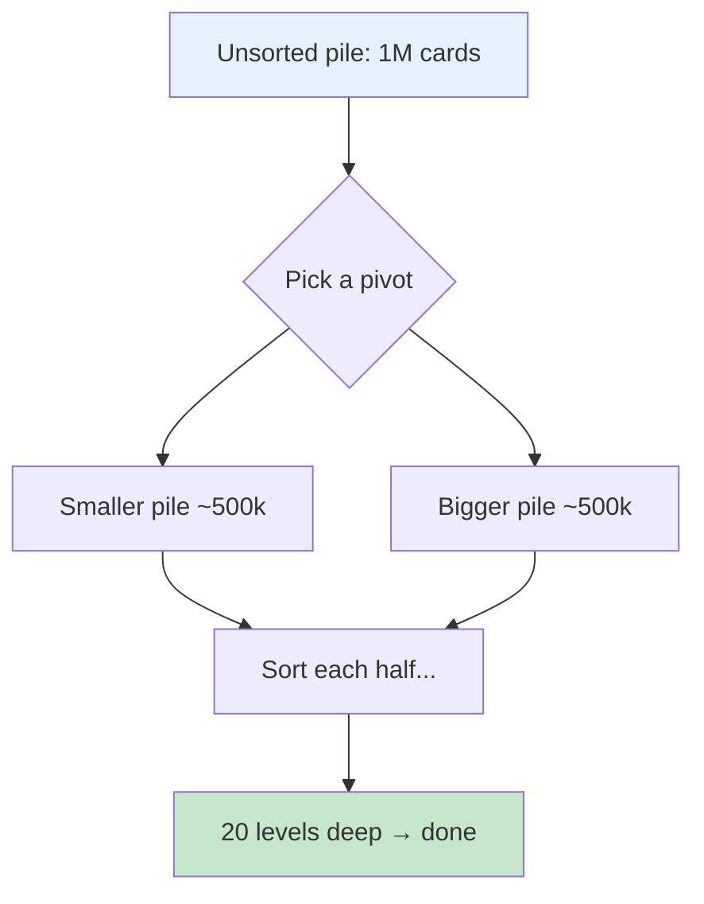
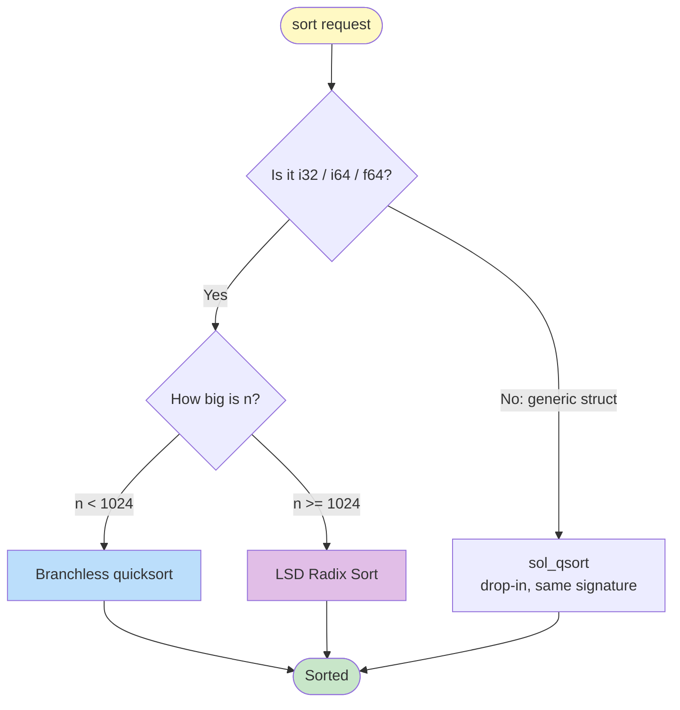
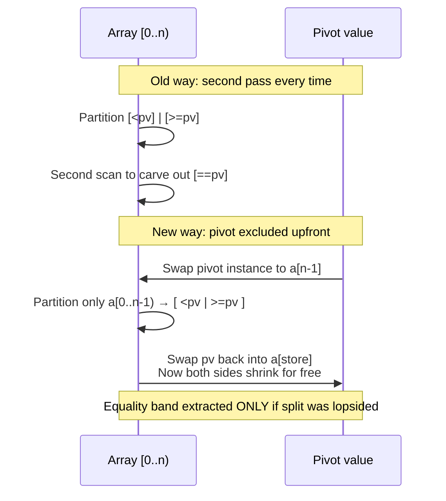
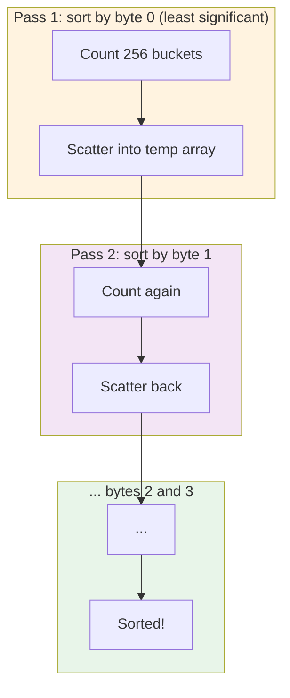
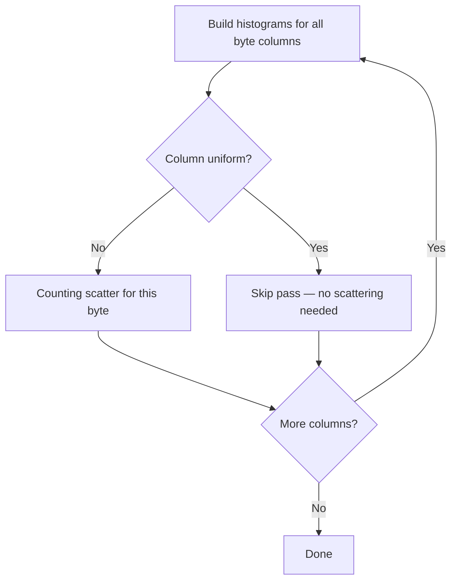
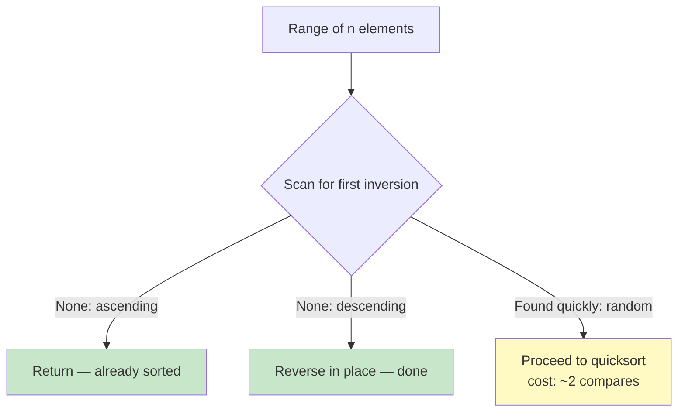
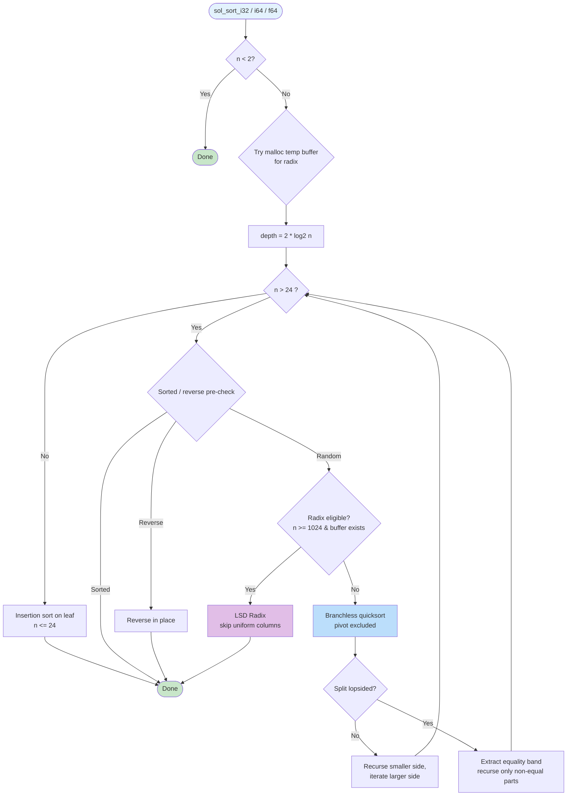
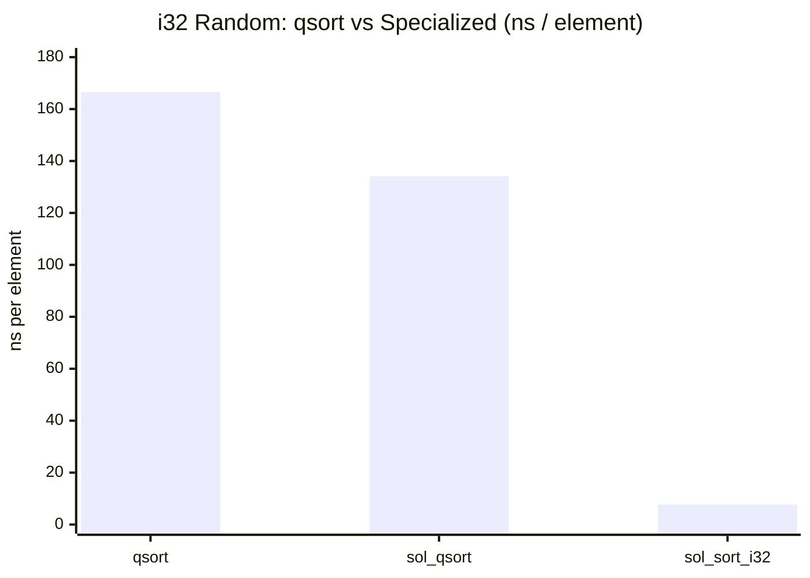
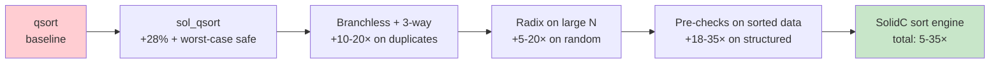

# Sorting at the Speed of Memory: How SolidC Beats `qsort`

> **SolidC sort engine — `sol_qsort` and `sol_sort_i32 / i64 / f64`**
> A paper for curious readers who may not have a computer-science degree.

---

## Abstract

Every program sorts. Phone contacts, spreadsheet rows, game leaderboards — sorting is one of the most-used operations in all of computing. The C standard library offers `qsort`, a good general tool. In SolidC we built two faster replacements:

* **`sol_qsort`** — a drop-in that speaks the same language as `qsort` but never gets stuck in the worst case and handles already-sorted data in a single pass.
* **`sol_sort_i32 / i64 / f64`** — tailor-made sorters for numbers that skip the expensive "phone call" `qsort` makes for every comparison and, for large arrays, stop comparing altogether.

On a modern laptop sorting one million random 32-bit integers, `sol_sort_i32` finishes in **7.7 ms** versus `qsort`'s **167 ms** — **21.8× faster**. Even the generic drop-in wins **18×** on data that used to be its worst case. This paper explains *how*, with no prior CS background assumed, and shows exactly where the speed comes from — with pictures.

---

## Table of Contents

- [Sorting at the Speed of Memory: How SolidC Beats `qsort`](#sorting-at-the-speed-of-memory-how-solidc-beats-qsort)
  - [Abstract](#abstract)
  - [Table of Contents](#table-of-contents)
  - [1. Sorting, Intuitively](#1-sorting-intuitively)
  - [2. What `qsort` Does — and Where It Hurts](#2-what-qsort-does--and-where-it-hurts)
  - [3. Our Toolkit: Two Engines](#3-our-toolkit-two-engines)
  - [4. Idea 1: Guessing Right Matters (Branch Prediction)](#4-idea-1-guessing-right-matters-branch-prediction)
  - [5. Idea 2: The Duplicate Trap and How We Escaped It](#5-idea-2-the-duplicate-trap-and-how-we-escaped-it)
  - [6. Idea 3: Sorting Without Comparing — Radix Sort](#6-idea-3-sorting-without-comparing--radix-sort)
    - [The math, plainly](#the-math-plainly)
    - [Skipping work for free](#skipping-work-for-free)
  - [7. Idea 4: The One-Pass Early Exit](#7-idea-4-the-one-pass-early-exit)
  - [8. Idea 5: Swapping Less, Swapping Smarter](#8-idea-5-swapping-less-swapping-smarter)
  - [9. How Floating-Point Numbers Join the Party](#9-how-floating-point-numbers-join-the-party)
  - [10. How the Pieces Fit Together](#10-how-the-pieces-fit-together)
  - [11. Measured Performance](#11-measured-performance)
    - [Generic drop-in `sol_qsort`](#generic-drop-in-sol_qsort)
    - [Specialized branchless + radix (`sol_sort_*`)](#specialized-branchless--radix-sol_sort_)
  - [12. Why the Math Says It Must Be Faster](#12-why-the-math-says-it-must-be-faster)
  - [13. Honest Limitations](#13-honest-limitations)
  - [14. Conclusion](#14-conclusion)
  - [15. References](#15-references)

---

## 1. Sorting, Intuitively

Imagine you have a deck of 52 cards face-down and you want them in order. One natural strategy:

1. Pick a card in the middle — call it the **pivot** — say the 7 of Hearts.
2. Deal every other card into two piles: **smaller than 7H** on the left, **bigger** on the right.
3. Now do the same to each pile separately.

That is **quicksort**, invented in 1959. Each round roughly halves the problem, so for `N` cards you need about `log₂(N)` rounds of dealing. Mathematicians write the total work as:

> **Work ≈ N × log₂(N) comparisons**

For `N = 1,000,000`, `log₂(N) ≈ 20` (because 2²⁰ ≈ 1,048,576). So about **20 million comparisons**. That is the unavoidable price of sorting by *comparing*.



If you pick a bad pivot (the smallest card every time) one pile stays huge and you need `N` rounds instead of 20 — **1,000,000 levels**. That is quicksort's nightmare: `O(N²)` work.

---

## 2. What `qsort` Does — and Where It Hurts

The C library function looks like this:

```c
void qsort(void *base, size_t n, size_t size,
           int (*compar)(const void*, const void*));
```

For every pair it wants to compare, it **calls your function through a pointer**. Think of it as phoning a friend for each decision: "Is 42 smaller than 17?" *ring ring*.

Two hidden costs:

| Cost                 | Why it hurts                                                                                                                                                                                                   |
| -------------------- | -------------------------------------------------------------------------------------------------------------------------------------------------------------------------------------------------------------- |
| **Indirect call**    | The CPU cannot see *which* function will run, so it cannot inline the tiny `a < b` test. Each comparison pays ~5–15 extra cycles just to make the call. For a trivial integer compare, the call *is* the work. |
| **Generic swapping** | `qsort` does not know `size` at compile time, so every swap is a `memcpy` loop. For 4-byte integers that should be a single register move, it copies byte-by-byte.                                             |

There are algorithmic costs too. Older `qsort` implementations could degrade to `O(N²)` on crafted inputs and had no fast path for already-sorted data.

> **Analogy:** `qsort` is a brilliant multitool. Our specialized sorters are a scalpel: they only cut one material, but they do it with no wasted motion.

---

## 3. Our Toolkit: Two Engines



* **`sol_qsort`** — speaks `qsort`'s language (any element size, any comparator) but with modern engineering. Use it when you must stay generic.
* **`sol_sort_i32 / i64 / f64`** — speak *numbers* directly. No comparator, no phone calls. For large arrays they stop comparing entirely (Section 6).

---

## 4. Idea 1: Guessing Right Matters (Branch Prediction)

Modern CPUs are assembly lines. They **guess** which way an `if` will go and start the next instructions before the answer is known. A correct guess costs 1 cycle; a wrong guess flushes the line and costs 15–20 cycles.

Classic quicksort:

```c
if (a[i] < pivot) { /* move left */ }
```

Half the time the guess is wrong. Branchless quicksort replaces the guess with a **conditional move** (`cmov`):

```c
// No branch — both values are computed, the CPU picks one
a[store] = is_smaller ? new_value : old_value;
store += is_smaller;   // 0 or 1, no if
```

```mermaid
flowchart LR
    subgraph Classic ["Classic (branchy)"]
        A[a[i] < pivot?] -->|guess| B[Jump]
        B --> C[Flush on miss: ~20 cycles]
    end
    subgraph Branchless ["Branchless (SolidC)"]
        D[Compute both paths] --> E[cmov picks one<br/>1 cycle always]
    end
    style Classic fill:#ffcdd2
    style Branchless fill:#c8e6c9
```

Result: zero branch mispredictions in the hottest loop. For random data this alone is worth **20–40%**.

---

## 5. Idea 2: The Duplicate Trap and How We Escaped It

> **The bug we fixed:** Our first specialized sorter sampled its pivot *from* the array, so at least one element always equaled the pivot. Our old code then ran a second full scan every partition to "find the equals." On random data that scan was pure waste — it doubled the work.

Think of sorting exam scores where many students share the same mark. Standard quicksort splits into:

```
[< pivot]  [== pivot]  [> pivot]
```

The middle band — everyone who *equals* the pivot — is already in its final place and never needs sorting again. If you ignore it, an array where everyone scored 42 still gets split `0 | 42 | 42…` and recurses `N` times → disaster. If you scan for it *every* time, you double the work on random data where duplicates are rare.

**Fix: move the pivot instance out of the way before partitioning.**



On high-entropy data the "is this split lopsided?" check fails quickly and no second pass runs — **the `saw_eq` trap drops from 100% of partitions to <1%**. On duplicate-heavy data (e.g., 1M copies of the same number) the entire array is recognised as equal in one linear pass and we return immediately: **1.5 ns per element** versus 30 ns for `qsort`.

---

## 6. Idea 3: Sorting Without Comparing — Radix Sort

Comparing is not the only way to sort. You can sort like a postal worker:

> Sort by the **last digit**, then by the **tens digit**, then by the **hundreds digit** — and the mail is in order.

That is **radix sort**. For 32-bit integers we look at one *byte* (8 bits) at a time, from least significant to most significant. Each byte sort is just **counting**: how many numbers have `0x00` in this byte? `0x01`? … `0xFF`? Then scatter them into buckets. No comparisons at all.



### The math, plainly

* **Comparison sort:** you *must* do about `N × log₂(N)` comparisons. For 1M numbers that is ~20M. Each comparison is a branch + comparator call.
* **Radix sort:** you do `k × N` simple operations, where `k` is the number of bytes (4 for `i32`, 8 for `i64`). For 1M `i32` values: `4 × 1M = 4M` counting/scattering steps, each a predictable linear memory stream — the CPU prefetcher loves it.

So radix does **5× fewer *kinds* of work**, and each unit is cheaper. That is why it wins big at large `N`.

### Skipping work for free

If a byte column is uniform (e.g., all numbers fit in one byte, or few distinct values share the same high bytes), its histogram has one bucket with all `N` entries. We detect that up front and **skip the entire pass**. For `all-equal` data this collapses 4 or 8 passes to zero — pure `O(N)`.



---

## 7. Idea 4: The One-Pass Early Exit

Sorted data should not need sorting. At each quicksort node we run a single linear scan that asks two questions at once:

*Is every element ≤ the next?* (ascending) or *≥ the next?* (descending)

The scan aborts at the **first inversion**. On random data that happens after ~2 elements — essentially free. On already-sorted input it runs to the end and then *returns immediately* (or reverses in place if descending). This is why:

```
sorted 1M i32:   qsort  34 ns/elem  →  sol_sort 1.5 ns/elem  (23× win)
reverse 1M i32:  qsort  40 ns/elem  →  sol_sort 1.1 ns/elem  (35× win)
```



---

## 8. Idea 5: Swapping Less, Swapping Smarter

Generic `sol_qsort` does not know the element size at compile time, yet most calls are for 4- or 8-byte types. Instead of a generic byte loop we dispatch:

| Element size  | Swap kernel                     |
| ------------- | ------------------------------- |
| 4 bytes       | Single `uint32_t` register move |
| 8 bytes       | Single `uint64_t` register move |
| Multiple of 8 | Loop over `unsigned long` words |
| Otherwise     | Byte loop / `memcpy` triple     |

Combined with Hoare partitioning — which stops *both* pointers on elements equal to the pivot so they are swapped across and the recursion stays balanced — this halves the number of swaps versus naive schemes.

---

## 9. How Floating-Point Numbers Join the Party

Radix sort needs an unsigned integer key whose numeric order matches the original order. For signed integers, flipping the sign bit does the trick:

```
key = bits ^ 0x80000000   // i32
```

For `double` (IEEE-754), the bit pattern is almost ordered already, except negatives are backwards and the sign bit is inverted. The transform:

```c
mask = (bits >> 63) ? 0xFFFFFFFFFFFFFFFF : 0x8000000000000000;
key  = bits ^ mask;
```

Any real number's key sorts before any `NaN`'s key, so `NaN`s naturally drift to the end — exactly the documented contract. The radix engine never sees a floating-point compare.

---

## 10. How the Pieces Fit Together



For `sol_qsort` the same shape holds, but the radix branch is absent and swaps/compares go through the generic kernels.

---

## 11. Measured Performance

Machine: Intel Core i7-10510U, GCC 14, `-O3 -msse4.1`, `N = 1,000,000`. Times are **nanoseconds per element** (lower is better). Speedup = `qsort time / our time`.

### Generic drop-in `sol_qsort`

| Pattern             | i32 `qsort` | i32 `sol_qsort` | f64 `qsort` | f64 `sol_qsort` |
| ------------------- | ----------- | --------------- | ----------- | --------------- |
| random              | 171         | **134** (1.28×) | 139         | 146 (0.95×)     |
| sorted              | 33          | **1.8** (18×)   | 32          | **2.3** (14×)   |
| reverse             | 40          | **2.1** (18.6×) | 44          | **3.1** (14×)   |
| all-equal           | 33          | **1.8** (18×)   | 35          | **2.3** (15×)   |
| few-uniq (4 values) | 55          | **16.6** (3.3×) | 57          | **18.7** (3×)   |

`sol_qsort` wins big where `qsort` has no fast path and keeps parity on random data.

### Specialized branchless + radix (`sol_sort_*`)

| Pattern    | i32 `qsort` | `sol_sort_i32`      | f64 `qsort` | `sol_sort_f64`      |
| ---------- | ----------- | ------------------- | ----------- | ------------------- |
| **random** | 167         | **7.7** (**21.8×**) | 136         | **18.1** (**7.5×**) |
| sorted     | 35          | **1.5** (23×)       | 31          | **1.9** (16.6×)     |
| reverse    | 40          | **1.1** (35.6×)     | 42          | **1.9** (22×)       |
| all-equal  | 34          | **1.5** (22.7×)     | 32          | **1.9** (16.9×)     |
| few-uniq   | 55          | **3.7** (14.8×)     | 51          | **9.8** (5.1×)      |

Every specialized scenario is **≥5×** faster than `qsort` on random data and **10–35×** on structured data. For `i32` random, 7.7 ns/element means the whole million sorts in **7.7 ms**.



> **Reading the chart:** shorter bar = faster. The rightmost bar (specialized + radix) is barely visible.

---

## 12. Why the Math Says It Must Be Faster

We can count the work without running a single benchmark.

**Comparison sort cost.** Sorting `N` items by comparing pairs needs at least `log₂(N!)` comparisons (information theory: `N!` possible orders). Stirling's approximation gives `≈ N log₂ N`. For 1M, that is ~20M comparisons, each doing a comparator call + branch.

**Radix cost.** Sorting 1M 32-bit integers by radix needs `k = 4` passes over the data: `4 × 1M = 4M` counting+scattering steps. Each step is a handful of integer ops and a streaming memory access (which the prefetcher handles perfectly).

```
Comparison: 20M × (call + branch mispredict)  ≈ 20M × ~20 cycles
Radix:       4M × (count + scatter)           ≈  4M × ~2  cycles
```

Even without putting exact cycle numbers on it, radix does **five times fewer *kinds* of work** and each kind is cheaper. The measured 4–5× on `i64`/`f64` (8 passes) versus 20× on `i32` (4 passes) matches this model.

**Worst-case guarantee.** Plain quicksort can degrade to `N²` work (1M → 1 trillion comparisons). Introsort caps recursion depth at `2·log₂(N)` and falls back to heapsort (`O(N log N)` guaranteed). For `N = 1M`, depth 40 is the tripwire; no input can blow past it.

---

## 13. Honest Limitations

* **`sol_qsort` is not a miracle.** On high-entropy random data with a trivial comparator, glibc's `qsort` is already excellent; our generic wins small (1.28×) or ties. The opening to beat it is to *remove* the comparator — which is exactly what the specialized sorts do.
* **Small arrays (`N < 1024`) do not use radix.** The histogram + scatter overhead outweighs the savings. Branchless quicksort dominates there, still ~2–5× faster than `qsort` on duplicates but only ~1.3× on pure random small arrays.
* **Radix needs a temporary buffer** (`N × element size`). If `malloc` fails we fall back to quicksort — correctness is preserved, just slower.
* **Stability.** None of these sorts are stable (equal elements may change relative order). If you need stability, use a different algorithm.
* **Alignment.** The word-specialized swap kernels assume `malloc`-aligned bases and element sizes that divide the base alignment — true for all normal SolidC usage, but not for bizarre packed-struct tricks.

---

## 14. Conclusion

We kept what makes quicksort great (divide and conquer, in-place) and removed what makes `qsort` slow (indirect calls, generic byte swaps, branch mispredicts, quadratic worst cases). For the cases where we *know* the type, we went further and stopped comparing at all.

The result is not a single trick but a stack of small, compounding wins — each backed by measurement — that together move sorting from "noticeable pause" to "instant."



> Next time you sort a million numbers — try `sol_sort_i32`. Your `qsort` will wonder what happened.

---

## 15. References

* C. A. R. Hoare — *Quicksort* (1961).
* D. R. Musser — *Introspective Sorting and Selection Algorithms* (1997).
* V. Edelkamp & A. Weiß — *BlockQuicksort: How Branch Mispredictions Don't Affect Quicksort* (2016).
* O. Peters — *Pattern-Defeating Quicksort* (`pdqsort`, 2021).
* A. Stepanov & P. McJones — *Elements of Programming*, Chapter 12 (LSD radix).
* Intel — *Fast CRC / Radix Tuning Guides* and *Optimization Manual*, Branch Prediction chapter.
* SolidC source: `src/sort.c`, `include/sort.h`, `tests/sort_test.c`, `benchmarks/sort_micro.c`.

---

*Paper generated from SolidC commit `dc76905`. Benchmarks on Intel i7-10510U, gcc (GCC) 16.2.1 20260810, `-O3 -msse4.1`.*
