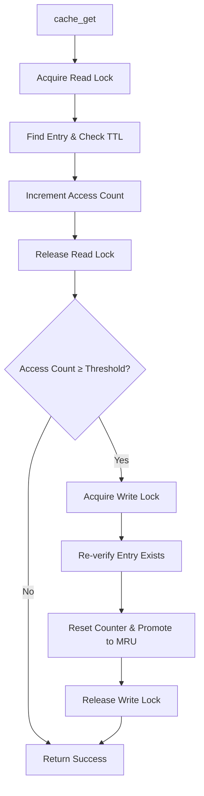
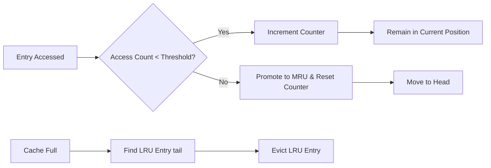

# Cache Implementation Technical Specification

## 1. Overview

### 1.1 Purpose
A high-performance, thread-safe, in-memory key-value cache implementation with configurable capacity, TTL (Time-To-Live) expiration, and LRU (Least Recently Used) eviction policy.

### 1.2 Key Features
- **Thread-safe** with read-write locks for concurrent access
- **TTL-based expiration** with configurable timeouts
- **LRU eviction** when capacity is reached
- **Lazy promotion** to optimize hot entry access
- **Cross-platform** support (Windows/Linux/macOS)
- **Memory-efficient** with configurable capacity limits

## 2. Architecture

### 2.1 System Diagram
```
┌─────────────────────────────────────────────────────────────┐
│                        Cache Instance                       │
├─────────────────────────────────────────────────────────────┤
│  ┌─────────────┐  ┌─────────────┐  ┌─────────────┐         │
│  │   Entry 1   │  │   Entry 2   │  │   Entry N   │         │
│  │ key: "user1"│  │ key: "user2"│  │ key: "dataN"│         │
│  │ value: data │  │ value: data │  │ value: data │         │
│  │ expires: t1 │  │ expires: t2 │  │ expires: tN │         │
│  └─────────────┘  └─────────────┘  └─────────────┘         │
│        ↑              ↑              ↑                     │
│        │              │              │                     │
│  ┌─────┼──────────────┼──────────────┼─────┐               │
│  │     ↓              ↓              ↓     │               │
│  │  ┌────────┐    ┌────────┐      ┌────────┐ │ Hash Table  │
│  │  │Bucket 0│    │Bucket 1│ ...  │Bucket M│ │ (O(1) lookup)│
│  │  └────────┘    └────────┘      └────────┘ │             │
│  └───────────────────────────────────────────┘             │
│                                                            │
│  ┌─────────────────────────────────────────────────────┐   │
│  │                    LRU List                         │   │
│  │  HEAD → [Entry] → [Entry] → ... → [Entry] → TAIL    │   │
│  │  (MRU)                               (LRU)          │   │
│  └─────────────────────────────────────────────────────┘   │
└─────────────────────────────────────────────────────────────┘
```

### 2.2 Data Structures

#### Cache Structure
```c
typedef struct cache {
    size_t capacity;           // Maximum number of entries
    size_t size;              // Current number of entries
    size_t bucket_count;      // Hash table bucket count
    uint32_t default_ttl;     // Default TTL in seconds
    cache_entry_t** buckets;  // Hash table buckets
    cache_entry_t* head;      // LRU list head (most recently used)
    cache_entry_t* tail;      // LRU list tail (least recently used)
    rwlock_t lock;            // Read-write lock for thread safety
} cache_t;
```

#### Entry Structure
```c
typedef struct cache_entry {
    char key[CACHE_KEY_MAX_LEN];      // Null-terminated key string
    unsigned char* value;             // Binary data value
    size_t value_len;                 // Value length in bytes
    time_t expires_at;                // Expiration timestamp
    uint32_t access_count;            // Access counter for lazy promotion
    struct cache_entry* hash_next;    // Next entry in hash bucket
    struct cache_entry* prev;         // Previous entry in LRU list
    struct cache_entry* next;         // Next entry in LRU list
} cache_entry_t;
```

## 3. Core Algorithms

### 3.1 Hash Function (FNV-1a)
```cpp
uint32_t hash = 2166136261u;
for (each byte in key) {
    hash ^= byte;
    hash *= 16777619u;
}
return hash;
```

### 3.2 LRU Management
```
Operations:
1. lru_add_to_front()    - Add new entry to MRU position
2. lru_move_to_front()   - Move existing entry to MRU position  
3. lru_remove()          - Remove entry from LRU list
4. evict_lru()           - Remove and free tail entry (LRU)
```

### 3.3 Lazy Promotion Algorithm


## 4. Thread Safety Model

### 4.1 Locking Strategy
- **Read Lock**: For lookup operations (`cache_get`)
- **Write Lock**: For modification operations (`cache_set`, `cache_invalidate`, promotion)

### 4.2 Cross-Platform Implementation
```c
#ifdef _WIN32
    // Windows SRWLOCK
    InitializeSRWLock() / AcquireSRWLockShared() / AcquireSRWLockExclusive()
#else
    // POSIX pthread_rwlock_t  
    pthread_rwlock_init() / pthread_rwlock_rdlock() / pthread_rwlock_wrlock()
#endif
```

## 5. API Specification

### 5.1 Core Functions

#### `cache_create()`
```c
cache_t* cache_create(size_t capacity, uint32_t default_ttl);
```
**Parameters:**
- `capacity`: Maximum entries (0 = use default)
- `default_ttl`: Default TTL in seconds (0 = use default)

**Returns:** Cache instance or NULL on failure

#### `cache_get()`
```c
bool cache_get(cache_t* cache, const char* key, char** out_value, size_t* out_len);
```
**Behavior:**
- Returns copy of value (caller must free)
- Checks TTL expiration
- Implements lazy LRU promotion

#### `cache_set()`
```c
bool cache_set(cache_t* cache, const char* key, const unsigned char* value, 
               size_t value_len, uint32_t ttl_override);
```
**Behavior:**
- Updates existing entries
- Evicts LRU if at capacity
- Uses TTL override or default

#### `cache_invalidate()`
```c
void cache_invalidate(cache_t* cache, const char* key);
```
**Behavior:** Removes specific key if exists

#### `cache_clear()`
```c
void cache_clear(cache_t* cache);
```
**Behavior:** Removes all entries

#### `cache_destroy()`
```c
void cache_destroy(cache_t* cache);
```
**Behavior:** Frees all resources

### 5.2 Configuration Constants
```c
#define CACHE_DEFAULT_CAPACITY     1000    // Default cache size
#define CACHE_DEFAULT_TTL          300     // Default TTL (5 minutes)
#define CACHE_KEY_MAX_LEN          256     // Maximum key length
#define CACHE_PROMOTION_THRESHOLD  5       // Access count for promotion
```

## 6. Memory Management

### 6.1 Allocation Strategy
- **Cache instance**: Single malloc
- **Hash table**: Calloc for buckets array
- **Entries**: Individual malloc for each entry
- **Values**: Individual malloc for each value

### 6.2 Memory Layout
```
┌─────────────┐    ┌─────────────┐    ┌─────────────┐
│  Cache      │    │ Hash Table  │    │ Entry 1     │
│  Structure  │───→│ Buckets[]   │───→│ key, value  │
└─────────────┘    └─────────────┘    │ next, prev  │
                                      └─────────────┘
                                            ↑
                                      ┌─────┘
                                 ┌────┴───┐
                            ┌───→│Entry 2 │
                            │    │key, ...│
┌─────────────┐    ┌────────┴─┐  └────────┘
│ LRU List    │    │ Entry 3  │
│ head → tail │───→│ key, ... │
└─────────────┘    └──────────┘
```

## 7. Performance Characteristics

### 7.1 Time Complexity
| Operation          | Average Case | Worst Case |
| ------------------ | ------------ | ---------- |
| `cache_get`        | O(1)         | O(n)       |
| `cache_set`        | O(1)         | O(n)       |
| `cache_invalidate` | O(1)         | O(n)       |
| `cache_clear`      | O(n)         | O(n)       |

### 7.2 Space Complexity
- **Structure Overhead**: O(b + n) where b = buckets, n = entries
- **Per Entry**: ~64 bytes + key + value

## 8. Eviction Policy

### 8.1 LRU with Lazy Promotion


### 8.2 TTL Expiration
- Checked on every `cache_get`
- Lazy cleanup (no background thread)
- Manual invalidation available

## 9. Error Handling

### 9.1 Input Validation
- NULL pointer checks
- Key length validation
- Empty key rejection
- Memory allocation failure handling

### 9.2 Thread Safety Guarantees
- No data races during concurrent access
- Deadlock-free through proper lock ordering
- Memory consistency through appropriate barriers

## 10. Testing Requirements

### 10.1 Unit Tests
- Basic CRUD operations
- LRU eviction correctness
- TTL expiration
- Thread safety under concurrent load
- Memory leak validation
- Error condition handling

### 10.2 Performance Tests
- Throughput under concurrent access
- Memory usage profiling
- Worst-case scenario handling
- Cross-platform consistency

## 11. Platform Considerations

### 11.1 Supported Platforms
- Windows (Vista+) with SRWLOCK
- Linux/macOS with pthreads
- C99 compliant compilers

### 11.2 Dependencies
- Standard C library (stdlib.h, string.h, time.h)
- Platform threading primitives
- No external dependencies

## 12. Limitations

### 12.1 Known Constraints
- Fixed maximum key length
- No persistence to disk
- No compression of values
- No statistics collection
- No background cleanup thread

### 12.2 Scalability Considerations
- Single read-write lock per cache instance
- Hash table collisions degrade to O(n)
- Memory fragmentation from individual allocations
